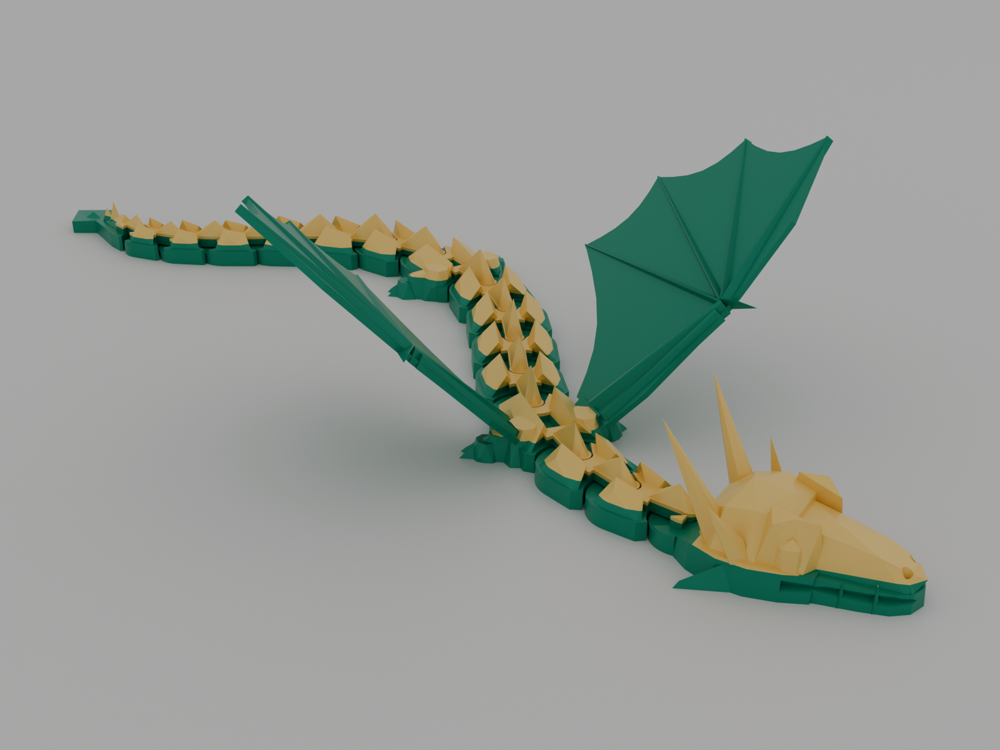
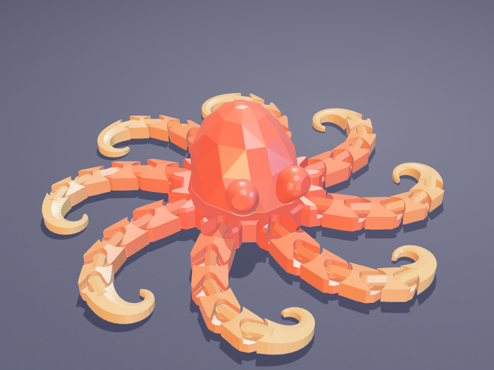
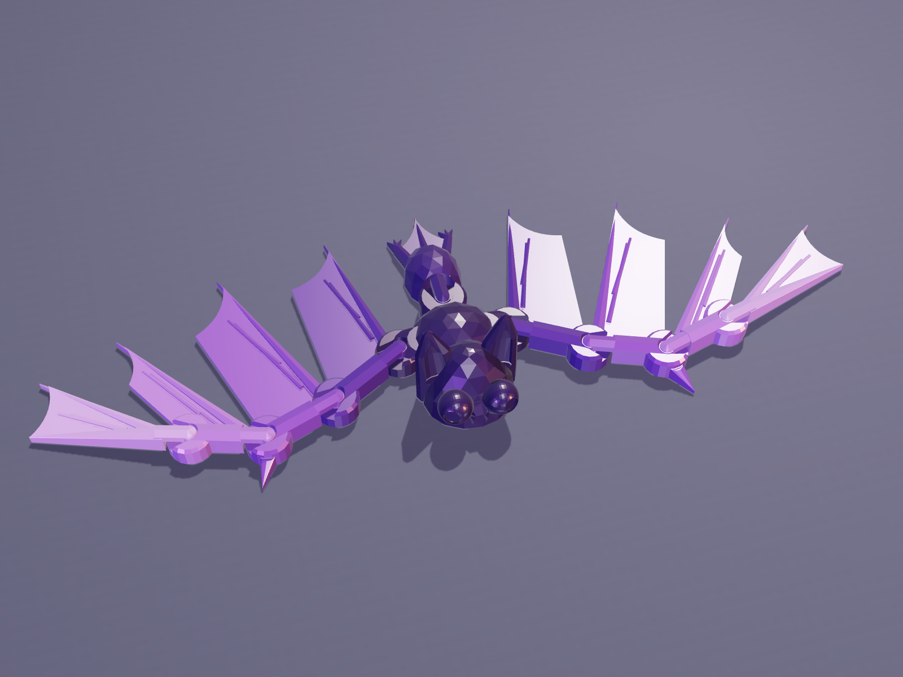
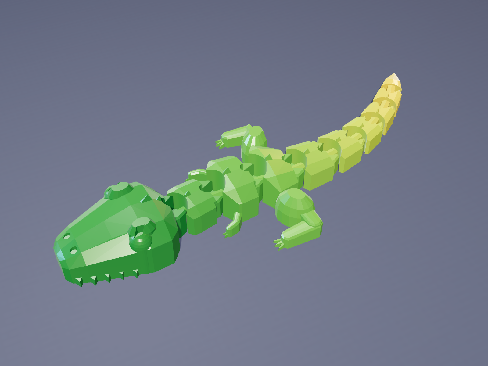

# Claude-Models

3D-printable models and the procedural Blender scripts that generate them.

## Gemscale Flexi Dragon

A low-poly, winged, articulated dragon that **prints in one piece with no supports**. It is
generated entirely by one Blender script, which also exports STL/3MF files, checks
printability, and renders cover images.

- Script: [`gemscale-dragon/gemscale_dragon.py`](gemscale-dragon/gemscale_dragon.py)
- How to use it: [`gemscale-dragon/README.md`](gemscale-dragon/README.md)
- Ready-to-print files: [`gemscale-dragon/models/`](gemscale-dragon/models/)
- MakerWorld listing kit: [`gemscale-dragon/MAKERWORLD_LISTING.md`](gemscale-dragon/MAKERWORLD_LISTING.md)

## Gemscale Flexi Octopus

A cute, faceted, articulated octopus that **prints in one piece with no supports** and is quick
to print (the mini takes about 40 minutes). It uses the same joint as the dragon. It's
generated by a pure-Python script (manifold3d, no Blender needed), which also checks
printability and exports STL/3MF files. A three.js studio renders the cover images.

- Script: [`gemscale-octopus/gemscale_octopus.py`](gemscale-octopus/gemscale_octopus.py)
- How to use it: [`gemscale-octopus/README.md`](gemscale-octopus/README.md)
- Ready-to-print files: [`gemscale-octopus/models/`](gemscale-octopus/models/)
- MakerWorld listing kit: [`gemscale-octopus/MAKERWORLD_LISTING.md`](gemscale-octopus/MAKERWORLD_LISTING.md)

## Gemscale Flexi Bat

A faceted Halloween bat that **prints in one piece with no supports**. It has slit-pupil
eyes, cupped ears, fangs, a wiggly abdomen, and real bat wings: arm, forearm and a hand of
four clawed fingers fanning out, all jointed so they fold back and forth. The keychain version hangs upside down by its tail. It uses the same
joint and the same pure-Python toolchain as the octopus.

- Script: [`gemscale-bat/gemscale_bat.py`](gemscale-bat/gemscale_bat.py)
- How to use it: [`gemscale-bat/README.md`](gemscale-bat/README.md)
- Ready-to-print files: [`gemscale-bat/models/`](gemscale-bat/models/)
- MakerWorld listing kit: [`gemscale-bat/MAKERWORLD_LISTING.md`](gemscale-bat/MAKERWORLD_LISTING.md)

## Gemscale Flexi T-Rex

A classic flexi T. rex that **prints in one piece with no supports**: a big toothy head, a
chain of ridged segments with tiny arms and big legs, and a long wiggly tail. Every joint
wiggles side to side. It's generated by a Blender script.

- Script: [`gemscale-trex/gemscale_trex.py`](gemscale-trex/gemscale_trex.py) (Blender)
- How to use it: [`gemscale-trex/README.md`](gemscale-trex/README.md)
- Ready-to-print files: [`gemscale-trex/models/`](gemscale-trex/models/)
- MakerWorld listing kit: [`gemscale-trex/MAKERWORLD_LISTING.md`](gemscale-trex/MAKERWORLD_LISTING.md)
