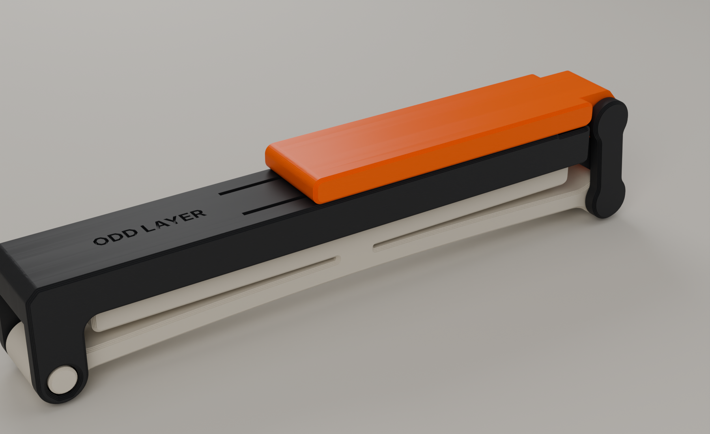
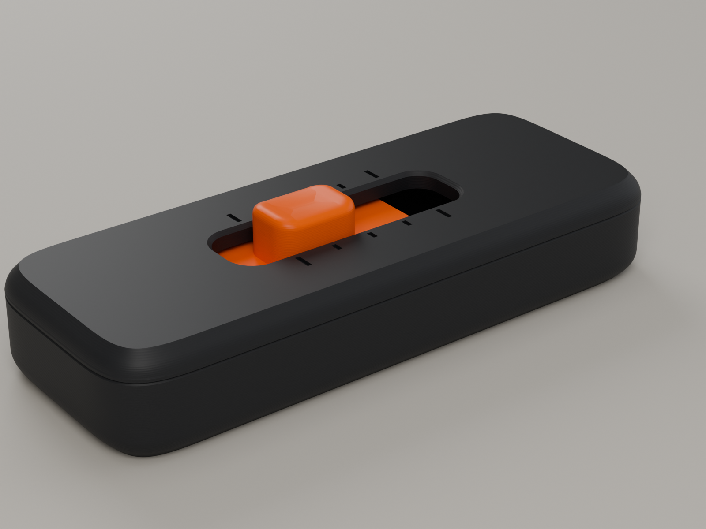
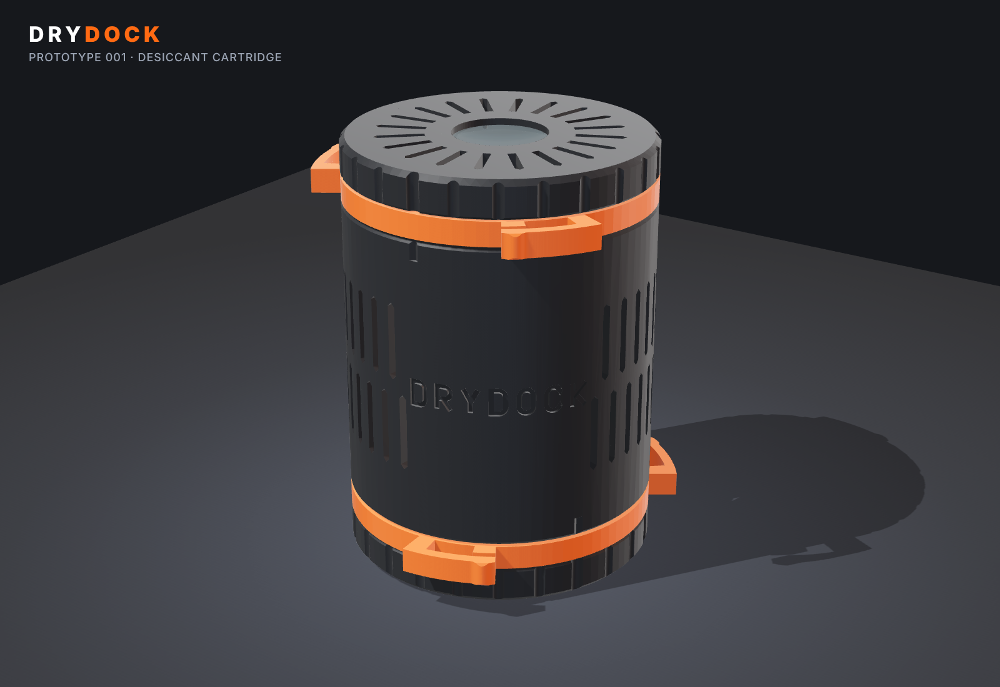
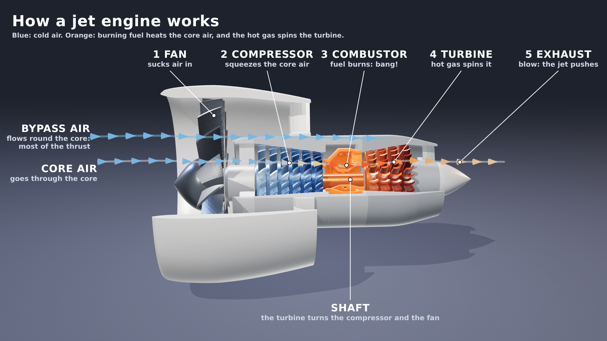
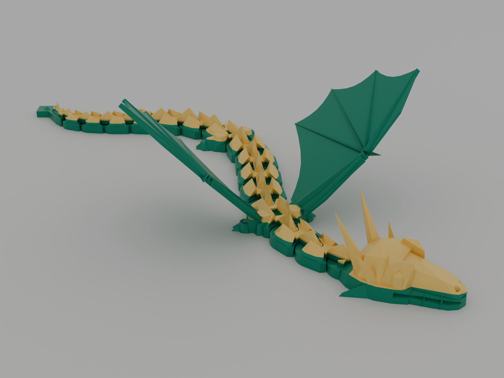
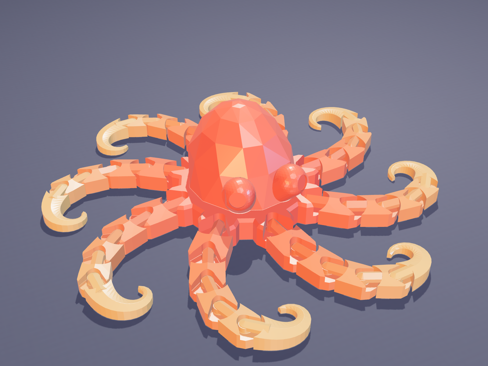
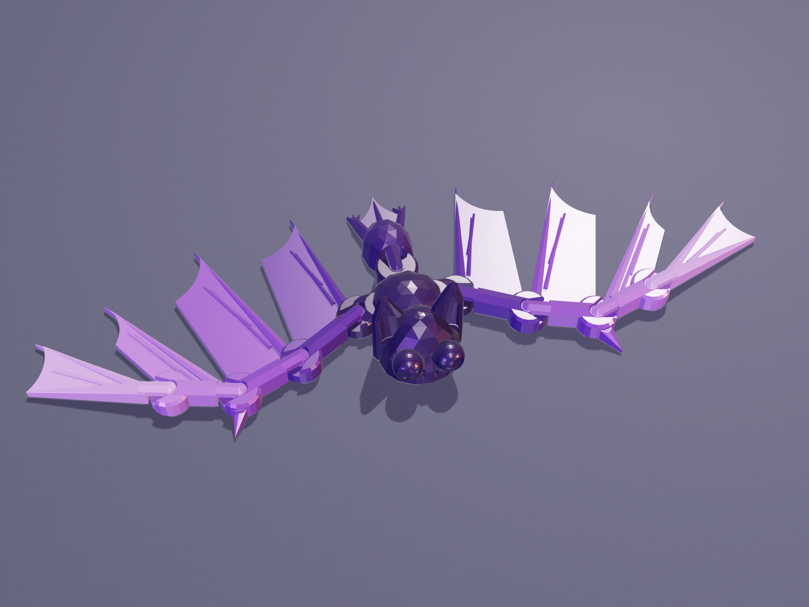
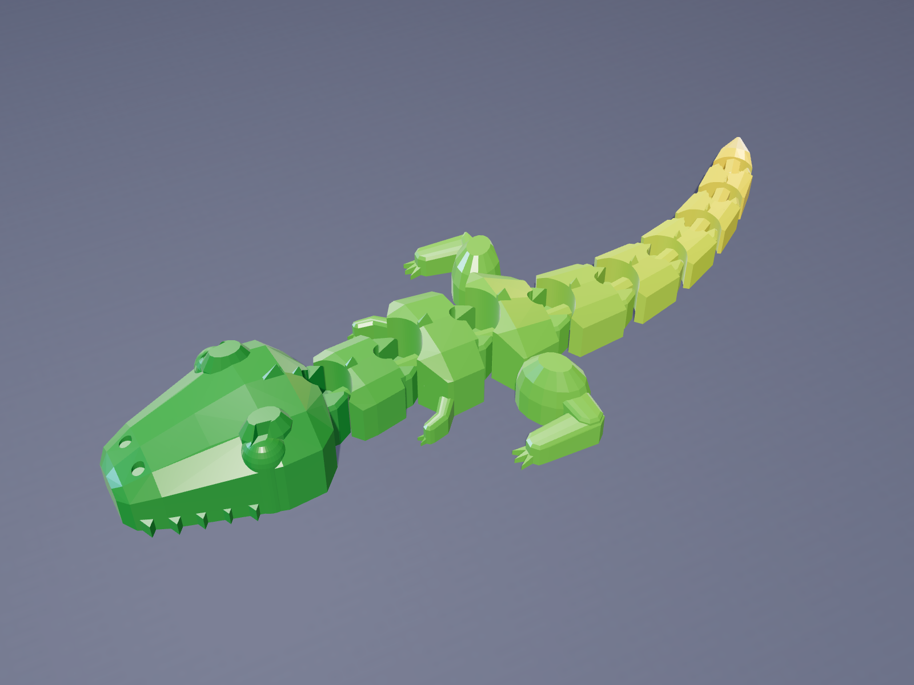

# Claude-Models

3D-printable models and the procedural Blender scripts that generate them.

## Odd Layer TC-03 ToggleClip

A fully printed **bag clip with a real over-centre lock**. Press the orange lever down: a bail
link pulls the lower jaw shut, passes 10° over centre and the lever lands flat with a click. Lift
it and the toggle pushes the jaws open again. The lower jaw is a floating pressure bar on an arched
bow spring, so the grip stays moderate and even for bags from 0 to 2 mm thick (model: 7–17 N in
PLA). It is 7 printed parts, with no hardware and no supports, and fits a 220 × 220 bed in PLA
or PETG. It is generated by a parametric Python script (manifold3d + shapely, with Blender for
the scene). The same script sweeps the mechanism through its whole travel (0 collisions),
models the spring and the lever forces, and exports STL, 3MF, a .blend and renders.
CAD-validated only: not yet printed.

- Scripts: [`toggleclip/toggleclip.py`](toggleclip/toggleclip.py) + [`toggleclip/tc/`](toggleclip/tc)
- Mechanism study, engineering report, PLA/PETG settings, assembly, limitations, test plan: [`toggleclip/README.md`](toggleclip/README.md)
- Validation report: [`toggleclip/models/TC03_validation_report.md`](toggleclip/models/TC03_validation_report.md)
- Print files: [`toggleclip/models/`](toggleclip/models/)

## Odd Layer ML-02 MotionLoop

A hand-cranked **desk mechanism**. One crank drives two opposed sliders through two
connecting rods, and everything that moves is in plain view. The crank is a built-up
two-throw crankshaft (cheek · wheel · cheek) running in two towers. The sliders run in 45°
dovetail grooves in a graphite plinth. The default MIRROR wheel puts the pins 180° apart, so
the sliders breathe out and in together. The optional SHUTTLE wheel puts them in line, so one
slider moves out while the other moves in. It is 13 printed parts (9 designs), with no
hardware and no supports. It is generated by a modular, parametric Blender script that also
sweeps the mechanism through a full turn (0 collisions), measures every fit, and exports STL,
3MF, an editable .blend and renders. CAD-validated only: not yet printed.

- Scripts: [`motionloop/motionloop.py`](motionloop/motionloop.py) + [`motionloop/ml/`](motionloop/ml) (Blender / bpy)
- Mechanism study, dimensions, tolerances, Bambu Studio settings, assembly, weak points, test plan: [`motionloop/README.md`](motionloop/README.md)
- Validation report: [`motionloop/models/ML02_validation_report.md`](motionloop/models/ML02_validation_report.md)
- Print files: [`motionloop/models/`](motionloop/models/)

## Odd Layer SL-01 SlideLock

A pocket **slider fidget** whose whole point is the feel: _tick · tick · tick · LOCK_. An
orange knob runs 20 mm along a graphite body, with three light detents in the middle and a
firm lock at each end. At each end the spring holds the carriage against a hard stop, so
there is no rattle. Inside are two in-plane cantilever leaf springs on a captured carriage,
running in V-notch tracks in the walls. It has three printed parts, no hardware and no
supports, plus Soft / Standard / Firm carriages. It is generated by one parametric Blender
script that also checks every fit, sweeps the full travel with the springs bent to a detent
model, and exports STL, 3MF, an editable .blend and renders. CAD-validated only: not yet
printed.

- Script: [`slidelock/slidelock.py`](slidelock/slidelock.py) (Blender / bpy)
- Concept, mechanism study, engineering, print settings, assembly, risks and prototype plan: [`slidelock/README.md`](slidelock/README.md)
- Validation report: [`slidelock/models/SL01_validation_report.md`](slidelock/models/SL01_validation_report.md)
- Print files: [`slidelock/models/`](slidelock/models/)

## DRYDOCK Prototype 001

A refillable **desiccant cartridge for the hub of a filament spool**. It has a vented body, two
quarter-turn QuickLock caps with a detent click and a hard stop, replaceable indicator
windows, and spring-centring adapters for 51–61 mm spool bores. It uses six printed parts,
no hardware and no supports. It is generated by a parametric build123d script that checks
every fit with boolean geometry and exports STEP, STL and 3MF. CAD-validated only: not yet
printed.

- Script: [`drydock/drydock.py`](drydock/drydock.py)
- Engineering analysis, assembly, print settings and test plan: [`drydock/README.md`](drydock/README.md)
- Validation report: [`drydock/models/DD001_validation_report.md`](drydock/models/DD001_validation_report.md)
- Print files: [`drydock/models/`](drydock/models/)

## Cutaway Turbofan

A display model that **shows how a jet engine works**: a high-bypass turbofan with a quarter
of every casing cut away. Turn the spinner and the fan, six compressor stages and four turbine
stages turn together on one shaft. The stand spells out SUCK · SQUEEZE · BANG · BLOW. It has
20 printed parts, needs no supports and no screws, and is generated by a pure-Python script
(manifold3d) that also checks overhangs and every running clearance.

- Script: [`cutaway-turbofan/cutaway_turbofan.py`](cutaway-turbofan/cutaway_turbofan.py)
- How it works, printing and assembly: [`cutaway-turbofan/README.md`](cutaway-turbofan/README.md)
- Ready-to-print plates: [`cutaway-turbofan/models/`](cutaway-turbofan/models/)

## Gemscale Flexi Dragon

A low-poly, winged, articulated dragon that **prints in one piece with no supports**. It is
generated entirely by one Blender script, which also exports STL/3MF files, checks
printability, and renders cover images.

- Script: [`gemscale-dragon/gemscale_dragon.py`](gemscale-dragon/gemscale_dragon.py)
- How to use it: [`gemscale-dragon/README.md`](gemscale-dragon/README.md)
- Ready-to-print files: [`gemscale-dragon/models/`](gemscale-dragon/models/)
- MakerWorld listing kit: [`gemscale-dragon/MAKERWORLD_LISTING.md`](gemscale-dragon/MAKERWORLD_LISTING.md)

## Gemscale Flexi Octopus

A cute, faceted, articulated octopus that **prints in one piece with no supports** and is quick
to print (the mini takes about 40 minutes). It uses the same joint as the dragon. It's
generated by a pure-Python script (manifold3d, no Blender needed), which also checks
printability and exports STL/3MF files. A three.js studio renders the cover images.

- Script: [`gemscale-octopus/gemscale_octopus.py`](gemscale-octopus/gemscale_octopus.py)
- How to use it: [`gemscale-octopus/README.md`](gemscale-octopus/README.md)
- Ready-to-print files: [`gemscale-octopus/models/`](gemscale-octopus/models/)
- MakerWorld listing kit: [`gemscale-octopus/MAKERWORLD_LISTING.md`](gemscale-octopus/MAKERWORLD_LISTING.md)

## Gemscale Flexi Bat

A faceted Halloween bat that **prints in one piece with no supports**. It has slit-pupil
eyes, cupped ears, fangs, a wiggly abdomen, and real bat wings: arm, forearm and a hand of
four clawed fingers fanning out, all jointed so they fold back and forth. The keychain version hangs upside down by its tail. It uses the same
joint and the same pure-Python toolchain as the octopus.

- Script: [`gemscale-bat/gemscale_bat.py`](gemscale-bat/gemscale_bat.py)
- How to use it: [`gemscale-bat/README.md`](gemscale-bat/README.md)
- Ready-to-print files: [`gemscale-bat/models/`](gemscale-bat/models/)
- MakerWorld listing kit: [`gemscale-bat/MAKERWORLD_LISTING.md`](gemscale-bat/MAKERWORLD_LISTING.md)

## Gemscale Flexi T-Rex

A classic flexi T. rex that **prints in one piece with no supports**: a big toothy head, a
chain of ridged segments with tiny arms and big legs, and a long wiggly tail. Every joint
wiggles side to side. It's generated by a Blender script.

- Script: [`gemscale-trex/gemscale_trex.py`](gemscale-trex/gemscale_trex.py) (Blender)
- How to use it: [`gemscale-trex/README.md`](gemscale-trex/README.md)
- Ready-to-print files: [`gemscale-trex/models/`](gemscale-trex/models/)
- MakerWorld listing kit: [`gemscale-trex/MAKERWORLD_LISTING.md`](gemscale-trex/MAKERWORLD_LISTING.md)
