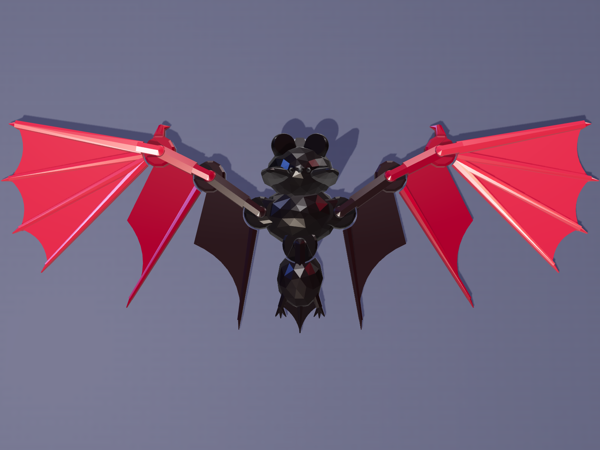
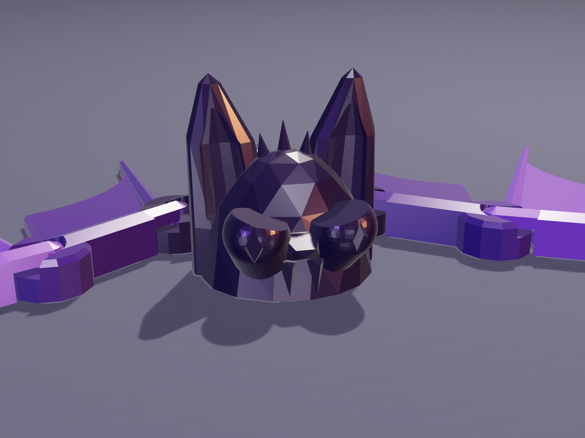
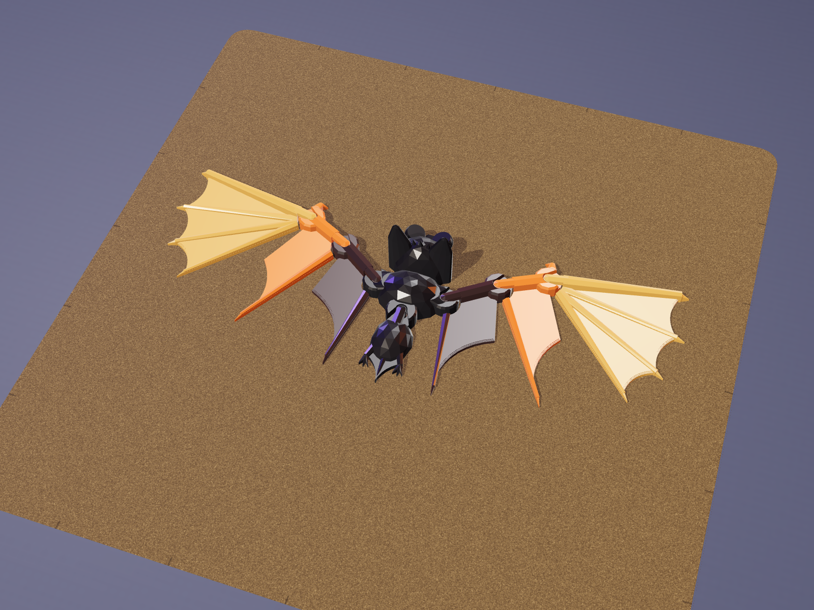
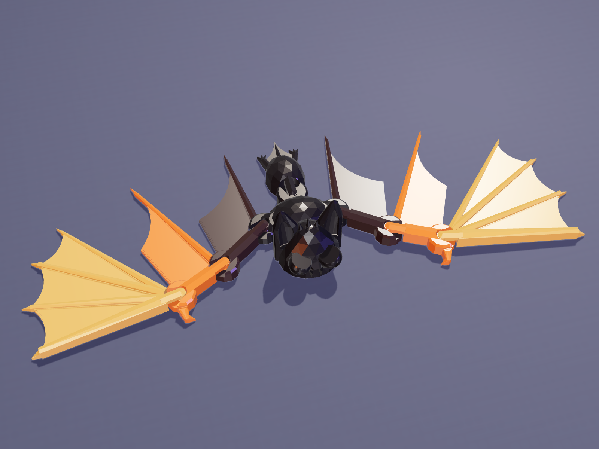
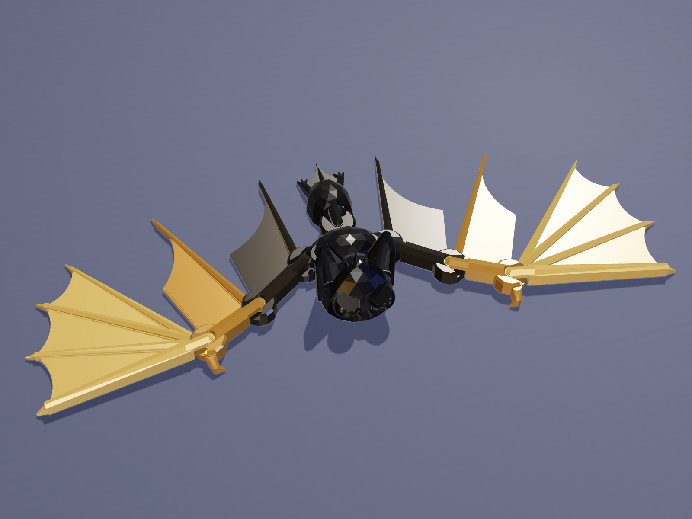
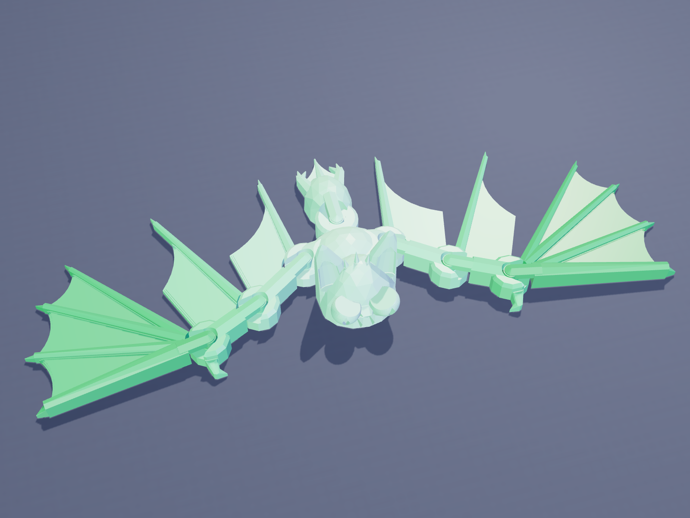
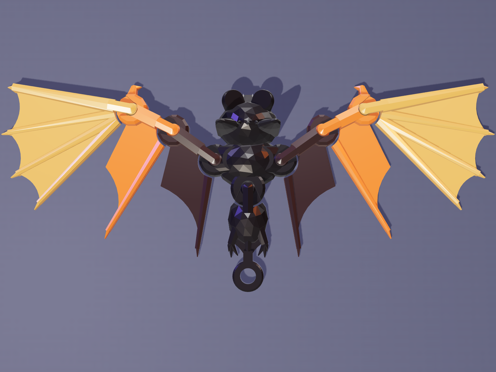

# Gemscale Flexi Bat: generator for a print-in-place articulated bat


`gemscale_bat.py` is a single Python script that builds a **low-poly articulated bat that
prints in one piece, fully assembled, with no supports**. It also runs its own
printability checks and exports slicer-ready STL and 3MF files. A small three.js studio in
`render/` makes MakerWorld-style 4:3 cover images.

It's the third model in the Gemscale series, after the
[Flexi Dragon](../gemscale-dragon/) and [Flexi Octopus](../gemscale-octopus/), and uses the
same proven print-in-place joint. The bat has:
- a gem-faceted head with broad cupped ears (each with a tragus inside), a crown tuft of
  three spikes, big eyes with heavy brows and diamond slit pupils, a snout and two fangs
- a broad faceted chest and belly
- two real bat wings: arm, forearm and a **hand whose four fingers fan out from the wrist**,
  with scalloped membranes between them. Bones are raised and ridged, every finger ends in
  a needle claw, the wrist has a hooked thumb, the knuckles are faceted gems, and the
  membranes have a layer-stepped bevel round their edges
- a jointed abdomen with clawed feet and a tail membrane

The wings fold back and forth in their own plane, and the abdomen wiggles side to side.

| | Mini | Standard |
|---|---|---|
| Wingspan | 114 mm | 167 mm |
| Size | 114 × 42 × 16 mm | 167 × 59 × 22 mm |
| Joints | 7 (shoulder, elbow, wrist per wing + abdomen) | 7 |
| Filament* | ~6 g | ~14 g |
| Print time* | ~25–35 min | ~50 min – 1 h |
| Bed | any (A1 mini and up) | any (A1 mini and up) |

\*These are estimates, not slicer output. Filament comes from the solid volume (2 walls,
15 % infill, PLA). Print time is scaled from the sliced Gemscale Dragon, which has the same
joints and settings. The wings are thin, so the bat prints quickly. Slice the 3MF in Bambu
Studio for real numbers before you publish them.



---

## Quick start

```bash
pip install -r requirements.txt          # manifold3d, numpy, trimesh (no Blender needed)

python gemscale_bat.py --preset standard --out models
python gemscale_bat.py --preset mini --keyring --out models
python gemscale_bat.py --preset standard --clearance 0.4 --out models   # looser joints
```

Options: `--preset mini|standard`, `--seed N` (changes the head and body facets),
`--clearance 0.35`, `--keyring` (a loop on the tail tip, so the bat hangs upside down from
your keys), `--bed 256x256`, `--out DIR`, `--no-check`.

Each run writes `GemscaleBat_<preset>_seed<N>.stl` / `.3mf` (one object, every part a
separate shell) and a `_report.txt` with the size, estimated filament and all the check
results. It also writes a `.glb` and `_parts.json` for the renderer; these are not committed.

## Ready-to-print files (`models/`)

| File | Use |
|---|---|
| `GemscaleBat_standard_seed7.3mf` | the main model |
| `GemscaleBat_standard_seed7_clearance0p40.3mf` | looser joints for printers that run tight, or for PETG |
| `GemscaleBat_mini_seed7.3mf` | small, quick version |
| `GemscaleBat_mini_seed7_keyring.3mf` | mini with a keychain loop on the tail |

STL copies are provided too.

## Print settings

- **0.20 mm layers.** The joint heights are snapped to this grid.
- **Supports off**, brim off, 2 walls, 15 % infill. Use PLA or silk PLA.
- The wing membranes are 1.6 mm thick (1.4 mm on the mini), and their top two layers step in
  to form a bevel. Make sure the first layer sticks well. A clean textured PEI plate works best.
- Keep part cooling on so the short tongue bridges come out clean.
- After printing, bend every joint gently. The first bend frees it.
- **Two-tone without an AMS:** add a filament change at **5.2 mm** (standard) or **4.7 mm**
  (mini). The head, ears, eyes and the tops of the chest and belly switch colour. The wings
  stay below that height, so they keep the first colour. Black first, then orange or purple,
  looks great.
- **Full multicolour:** every part is a separate shell. In Bambu Studio, right-click the model,
  choose **Split > To parts**, and colour the body and each wing panel.

---

## How it works

### The joint

Each joint is the Gemscale captured swivel, with the same clearances as the dragon and
octopus:

```
 side view of one joint:                    top view:
          ____                               F | housing ( knob ) <- tongue - R
      ___/    \___  <- 45 deg: no support      | the notch lets the tongue swing
     |   knob     |  <- vertical band
      \___    ___/  <- 45 deg
          \__/        sits on the bed
```

- The inner part (**F**) owns a round knuckle housing with a double-cone socket and a notch.
- The outer part (**R**) owns a knob that sits in the socket, joined to R by a tongue that
  bridges over the notch floor.
- Clearances: 0.35 mm around the knob (settable), 0.40 mm of air under each tongue (two
  layers), 0.40 mm beside the tongue, and 0.50 mm between the housing and the next part's cup.

### The wings

Each wing is three panels hinged along the leading-edge bone at the shoulder, elbow and
wrist, like a real bat's arm, forearm and hand. The arm and forearm each hold the membrane
between their own finger and the next joint. The hand carries the wing tip and fans four
fingers out from the wrist, with a scalloped membrane between each pair:

- Each panel's finger bone sits on one edge of a narrow V-shaped slit that starts at the next
  joint. The panel stays entirely on its own side of that line.
- The slit is 18.5° wide, which is the 14° back-fold plus a 4.5° margin. Folding forward
  (30°) needs no slit, because nothing sits in front of the leading edge.
- Every panel is clipped to its own swing sector, and every inner part is cut back out of the
  next panel's swept zone. That rules out collisions by construction, and the checks confirm it.
- The notch in each knuckle is the hard stop: wings fold 14° back and 30° forward per joint,
  so a wing sweeps up to 42° back or 90° forward overall.
- Cutting boundaries are kept a hair (0.05–0.3 mm) off the geometry they trim. Coincident
  faces can leave near-duplicate vertices, which merge when saved as float32 STL and open
  the mesh. A check catches this.

### The body

- **Head:** a leaning, faceted half-ellipsoid (the convex hull of jittered points; `--seed`
  changes the facets). It's widest at the base, so nothing overhangs.
- **Ears:** faceted leaves with rounded tips, a cupped hollow on the front and a tragus
  spike inside. Every inner surface is steeper than 45°.
- **Eyes:** spheres with a 45° "chin" underneath. A slanted cut on top makes a flat brow, low
  toward the nose, which gives a mischievous look. A diamond slit pupil looks forward; its
  pointed top means it prints without support. The crown tuft, snout and fangs are small
  faceted wedges with 45° undersides.
- **Abdomen:** wiggles ±25° on its own joint and carries the legs, three-toed feet, a tail bone
  and the tail membrane.

### Checks (every run)

1. Every part is a closed, valid manifold, and each part is a single connected piece.
2. The union of all parts still has one shell per part, so nothing is fused.
3. Every gap inside a joint is at least the clearance. Unlinked parts are at least 0.45 mm apart.
4. Every joint swings through its full range (−14°, −7°, +15°, +30° for wings; ±12.5° and
   ±25° for the abdomen) without touching its neighbour.
5. There are no unsupported overhangs steeper than 45°, apart from the small tops of the
   pupil dimples and ear cups (about 5 mm²). Tongue undersides are short bridges.
6. The model fits the bed with a 5 mm margin.
7. Every socket keeps at least a 1 mm wall (measured to the flats of the faceted knuckles).
8. No vertices merge when the mesh is saved as a float32 STL.
9. Membranes are at least 1.2 mm thick.

These are geometric checks. Test-print a model before you publish it.

## Renders

```bash
cd render && npm install      # three.js + playwright-core; uses the system Chromium
node render.mjs ../models/GemscaleBat_standard_seed7.glb out.png --view hero --scheme midnight
```

Views: `hero`, `top`, `face`, `plate` (on a textured PEI plate) and `promo` (4:3 card with
headline text). Schemes: `midnight`, `pumpkin`, `vampire`, `blackgold`, `sunset`, `ghost`.
Set `CHROMIUM=/path/to/chrome` if Chromium isn't at `/opt/pw-browsers/chromium`.

| | |
|---|---|
|  |  |
|  |  |
|  |  |

See [`MAKERWORLD_LISTING.md`](MAKERWORLD_LISTING.md) for the title, description, tags and
print-profile plan.
