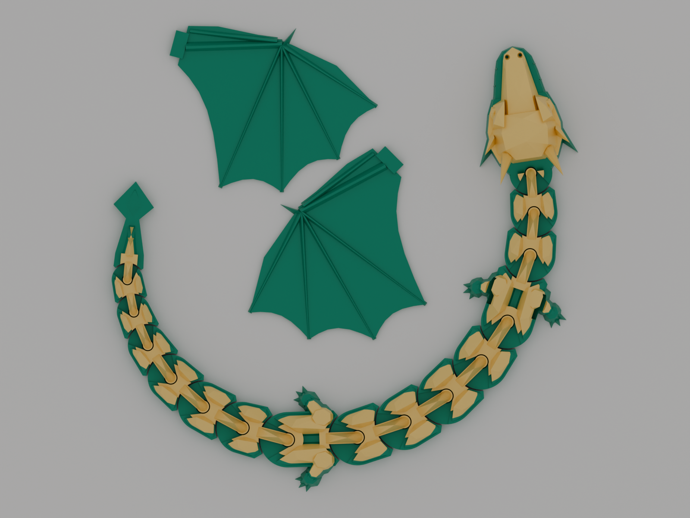
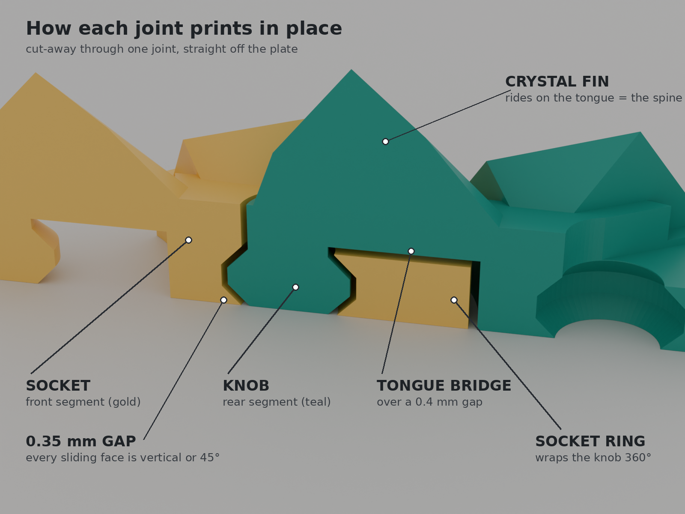

# Gemscale Flexi Dragon: Blender generator for a print-in-place articulated dragon


`gemscale_dragon.py` is a single Blender script that builds a **low-poly, winged, articulated
dragon that prints in one piece, fully assembled, with no supports**. It also exports
slicer-ready STL/3MF files, runs its own printability checks, and renders MakerWorld-style
4:3 cover images.

Articulated dragons are consistently among the most-downloaded models on MakerWorld.
This one is original: faceted "gem" scales, crystal dorsal fins, a horned head, chunky legs,
a spade tail and snap-in wings. Every random `seed` gives a slightly different dragon.

| | Mini (keychain) | Standard (hero) | Long |
|---|---|---|---|
| Stretched length | ~18 cm | ~31 cm | ~45 cm |
| Bed | 180 × 180 (A1 mini) | 180 × 180 (A1 mini) | 256 × 256 (A1 / P1 / X1 / P2S) |
| Joints | 13 | 15 | 24 |
| Filament* | ~11 g | ~35 g | ~46 g |
| Print time* | ~42 min | ~1 h 45 min | ~2 h 25 min |

\*Sliced with PrusaSlicer 2.7 using a Bambu-class profile (0.2 mm layers, 2 walls, 15 % infill,
wings included). Bambu Studio's numbers will differ somewhat.



---

## Quick start (Blender UI)

1. Install Blender **4.5 LTS or newer** (tested on 4.5 and 5.0). Blender 4.2 LTS also works;
   it lacks the fast Manifold boolean solver, so it's slower.
2. Open Blender, switch to the **Scripting** workspace, then use **Text > Open** to load `gemscale_dragon.py`.
3. Click **Run Script** (▶). A dragon appears, and a **Gemscale** tab is added to the
   3D-viewport sidebar (press **N** to show the sidebar).
4. In that tab, pick a preset, seed and features, then press **Generate Dragon**.
   The panel shows whether the printability checks passed.
5. Press **Export STL + 3MF**. The files go to `gemscale_export/` next to your .blend file
   (you can change the folder in the panel).
6. Optional: **Render Covers** makes four 1600 × 1200 images (hero, plate, head, side).
   This takes a few minutes with Cycles.

## Quick start (command line)

```bash
# standard dragon for an A1 mini bed
blender -b -P gemscale_dragon.py -- --preset standard --out ./export

# a unique mini keychain dragon, plus cover renders
blender -b -P gemscale_dragon.py -- --preset mini --seed 42 --render

# big dragon for a 256 mm bed with no wings and looser joints
blender -b -P gemscale_dragon.py -- --preset long --no-wings --clearance 0.4
```

All options: `--preset mini|standard|long`, `--seed N`, `--scale F`, `--bed 256x256`,
`--layout auto|coil|wave|straight`, `--clearance 0.35`, `--wing-fit 0.3`,
`--neck N --torso N --tail N`, `--no-wings --no-legs --no-horns --no-spikes --no-plates`,
`--keyring`, `--render`, `--samples N`, `--color-scheme emerald|obsidian|ruby|sunset|frost|rainbow`,
`--save file.blend`.

### What gets exported

| File | What it is |
|---|---|
| `GemscaleDragon_<preset>_seed<N>.3mf` / `.stl` | Everything on one plate, ready to slice (the wings sit inside the curl) |
| `..._body_only.stl` | Just the dragon |
| `..._wings_only.stl` / `.3mf` | Just the two wings, e.g. to print them in a different colour |
| `..._report.txt` | Size, recommended settings, colour-change height and check results |

This repo already contains exported files for all three presets (seed 7) in [`models/`](models/),
plus a looser-joint standard version (`..._clearance0p40`) for printers that run tight or for
PETG. The renders are in [`renders/`](renders/).

---

## Print settings (Bambu Studio / OrcaSlicer / PrusaSlicer)

- **Layer height 0.20 mm.** The joint gaps are designed around this value, so keep it.
- **Supports OFF.** Supports would fill the joint gaps.
- Brim off. Plate: textured PEI or clean smooth PEI with glue stick.
- 2 walls and 15 % infill are plenty. Standard PLA speeds are fine.
- PLA or silk PLA. PETG works too; if it fuses, raise the clearance to 0.40.
- **Two-tone trick:** add a filament change at the Z height printed in the report
  (5.2 mm for the standard dragon). The flanks, legs and wings stay colour 1, while the
  armour plates, fins, horns and head top become colour 2. This works with or without an AMS.
- After printing, flex each joint gently from side to side. The first bend may feel stiff.
- **Wings:** press each wing's tab into the matching slot on the dragon's shoulders; the
  wings tilt out at 45°. If the fit is loose, add a drop of glue. If it's tight, sand the tab
  or regenerate with `wing_fit` set to 0.40.

PrusaSlicer may warn about "low bed adhesion". That comes from the small knob pillars, which
stand on their own for the first ~4 mm until the tongue bridges join them. They are squat and
print fine. **Don't turn on supports because of this warning.**

### Troubleshooting

| Problem | Fix |
|---|---|
| Joints fused and won't break free | Print the included `clearance0p40` file (or regenerate with `clearance` 0.40–0.45), and check that the layer height is 0.2 mm |
| Joints too floppy | Use `clearance` 0.30 |
| Tongue bridges sag | Keep part cooling at 100 % and the bridge speed at or below 50 mm/s |
| Dragon doesn't fit your bed | Set `bed` to your printer's size; the layout is re-fitted automatically |
| Horn tips look rough | Slow down on small layers (Bambu Studio does this by default) |

---

## How the joint works



Each joint is a vertical **diamond-profile knob** (part of the rear segment) sitting in a
matching **socket** (part of the front segment):

- Every sliding surface is either vertical or at 45°, so nothing droops into the 0.35 mm gap
  while printing.
- The socket's lower ring surrounds the knob a full 360°, and the upper cone traps it from
  above, so joints can't pop apart.
- The knob connects to its own segment through a short **tongue** that bridges 4–9 mm over
  a 0.4 mm air gap (two layers). The tongue swings inside a notch that stops the joint at
  ±35°, so segments can never collide.
- Body shapes are cut so that each segment stays within a "V" cone behind its joint, and each
  housing is round around the joint axis. Bending can never make neighbours touch.
- A crystal dorsal fin sits on each knob and tongue, turning the joint line into the dragon's spine.

## Built-in verification

Every **Generate** runs these checks (the result appears in the panel and in the report):

- every part is a single closed, manifold shell
- no two parts touch (the smallest designed gap is 0.35 mm)
- every joint is swept through its full ±35° range, and the neighbours never intersect
- no downward-facing surface steeper than 45°, apart from the designed tongue bridges
- the wings lie on the plate without touching the dragon

During development the exported STLs were also checked outside Blender: sliced every 0.2 mm
with trimesh/shapely, the gap between parts never dropped below 0.346 mm on any layer and no
island started in mid-air. PrusaSlicer 2.7 sliced all presets without errors. A 64-configuration
random sweep (every preset, scale, bed, layout and feature toggle) passed every check on
Blender 5.0, and a 20-configuration sweep passed on Blender 4.2 LTS.

These checks are geometric. **Do a real test print before publishing**; the mini takes
about 40 minutes and is the quickest way to confirm the clearance on your printer.

## Customising

- `SETTINGS` at the top of the script sets the defaults, and `PRESETS` defines the three sizes.
- `seed` changes plate facets and fin heights, so every seed gives a new dragon.
- `neck`, `torso` and `tail` set the number of segments.
- Colour schemes are used only for the renders; the printed colours come from your filament.
- The script is organised in sections: 2D helpers, mesh builders, joint, anatomy, part
  builders, layout, checks, export, rendering and UI. Each part is built from convex hulls
  and booleans, and Blender's Manifold boolean solver is used when available (4.5+).

## Publishing on MakerWorld

See **[MAKERWORLD_LISTING.md](MAKERWORLD_LISTING.md)** for a ready-to-paste title,
description, tags, print-profile checklist and photo plan, plus the platform rules you must
follow: a real photo of the print is required, and AI-assisted work may need to be labelled.
