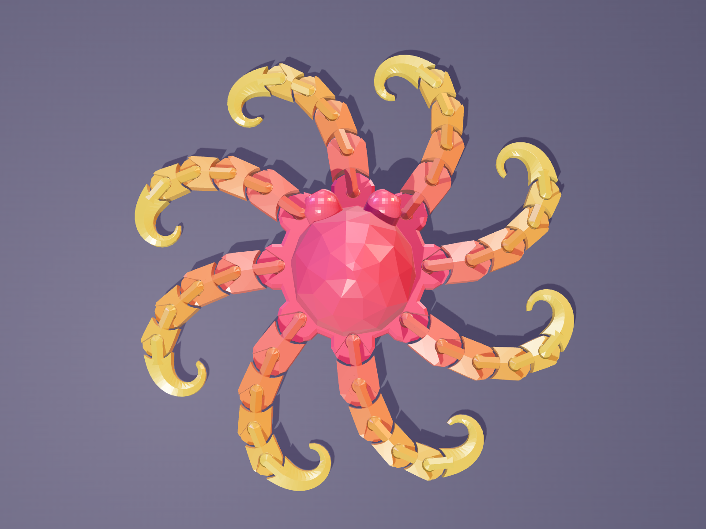
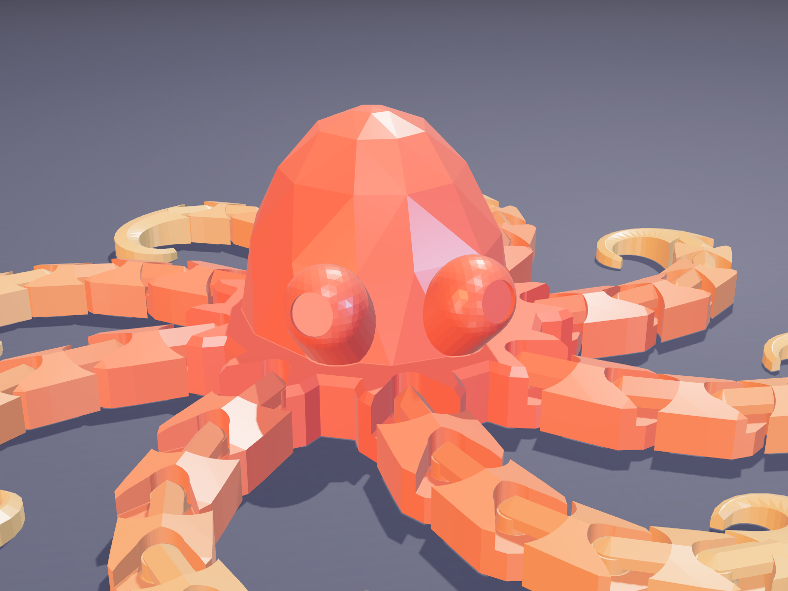
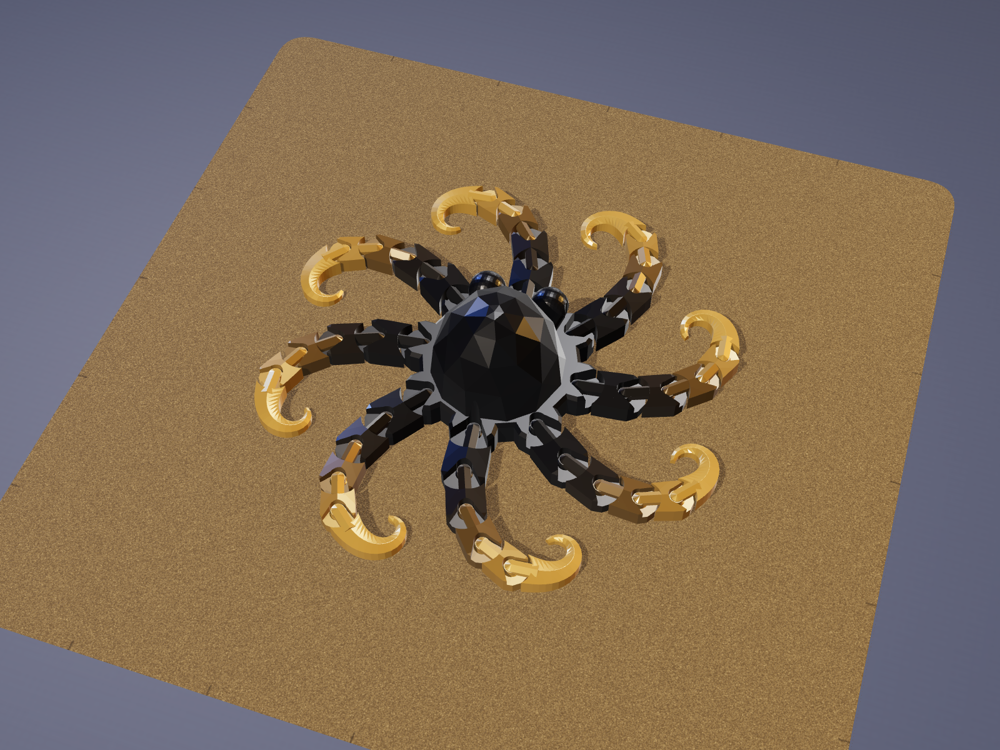
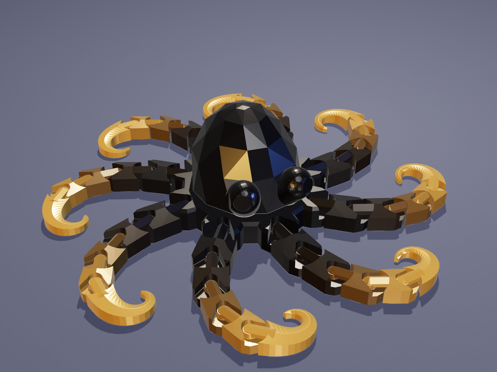
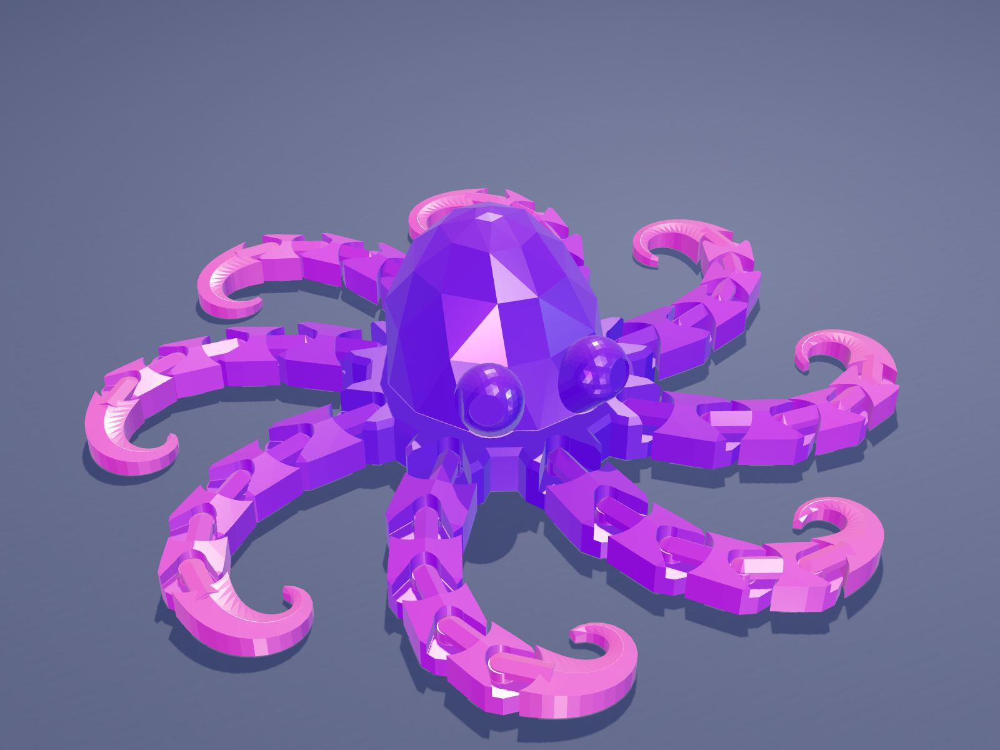
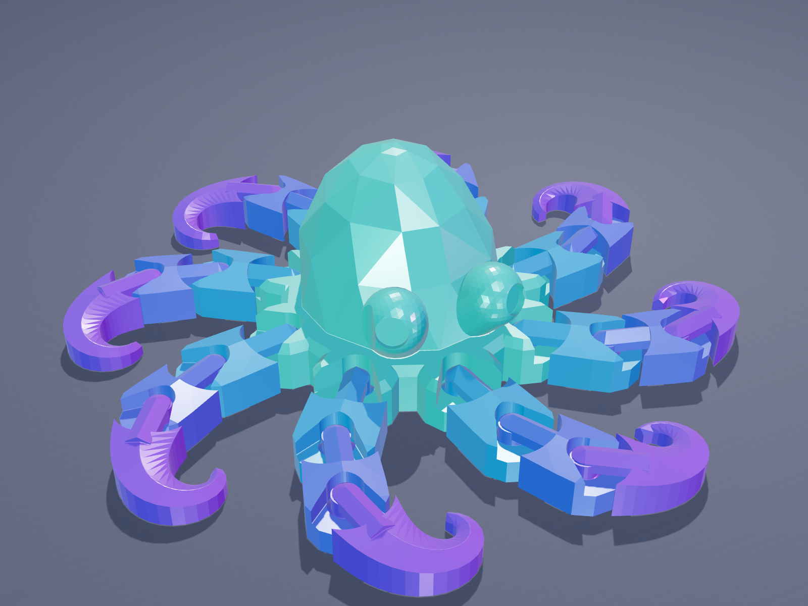
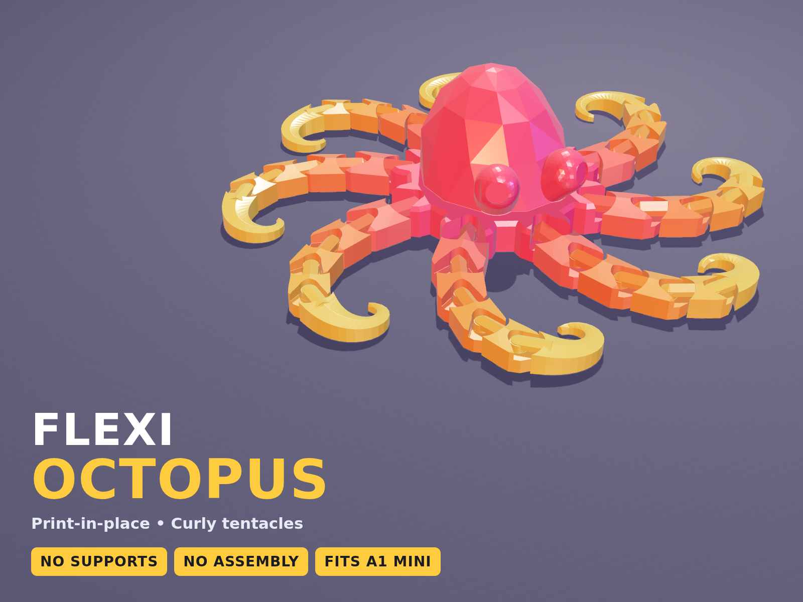

# Gemscale Flexi Octopus: generator for a print-in-place articulated octopus


`gemscale_octopus.py` is a single Python script that builds a **low-poly articulated octopus
that prints in one piece, fully assembled, with no supports**. It also runs its own
printability checks and exports slicer-ready STL and 3MF files. A small three.js studio in
`render/` makes MakerWorld-style 4:3 cover images.

It's a companion to the [Gemscale Flexi Dragon](../gemscale-dragon/). It uses the same
faceted "gem" style and the same proven print-in-place joint. The octopus has a gem-cut
mantle, big round eyes, and eight ridged tentacles that curl in a pinwheel and roll into
spiral tips. It's small, fast to print, and fits any bed.

| | Mini | Standard |
|---|---|---|
| Size | 65 × 65 × 20 mm | 106 × 106 × 28 mm |
| Joints | 24 (3 per arm) | 40 (5 per arm) |
| Filament* | ~11 g | ~25 g |
| Print time* | ~40 min | ~1 h 15 min – 1 h 30 min |
| Bed | any (A1 mini and up) | any (A1 mini and up) |

\*These are estimates, not slicer output. Filament comes from the solid volume (2 walls,
15 % infill, PLA). Print time is scaled from the sliced Gemscale Dragon, which has the same
joints and settings. Slice the 3MF in Bambu Studio for real numbers before you publish them.



---

## Quick start

```bash
pip install -r requirements.txt          # manifold3d, numpy, trimesh (no Blender needed)

python gemscale_octopus.py --preset standard --out models
python gemscale_octopus.py --preset mini --keyring --out models
python gemscale_octopus.py --preset standard --clearance 0.4 --out models   # looser joints
```

Options: `--preset mini|standard`, `--seed N` (changes the mantle facets), `--clearance 0.35`,
`--keyring` (adds a teardrop hole through the top of the mantle), `--bed 256x256`, `--out DIR`,
`--no-check`.

Each run writes:

| File | What it is |
|---|---|
| `GemscaleOctopus_<preset>_seed<N>.stl` / `.3mf` | the print file: one object, every part a separate shell |
| `..._report.txt` | size, estimated filament and the results of all checks |
| `..._parts.json` | the part list for the renderer (not committed) |
| `.glb` | the parts as separate meshes, for the renderer (not committed) |

## Ready-to-print files (`models/`)

| File | Use |
|---|---|
| `GemscaleOctopus_standard_seed7.3mf` | the main model |
| `GemscaleOctopus_standard_seed7_clearance0p40.3mf` | looser joints for printers that run tight, or for PETG |
| `GemscaleOctopus_mini_seed7.3mf` | quick ~40 min version |
| `GemscaleOctopus_mini_seed7_keyring.3mf` | mini with a keychain hole |

STL copies are provided too.

## Print settings

- **0.20 mm layers.** The joint heights are snapped to this grid.
- **Supports off**, brim off, 2 walls, 15 % infill. Use PLA or silk PLA.
- Keep part cooling on so the short tongue bridges come out clean.
- After printing, bend every joint gently from side to side. The first bend frees it.
- **Two-tone without an AMS:** add a filament change at **6.4 mm** (standard) or **5.0 mm**
  (mini). The mantle and eyes switch colour and the arms stay the first colour. The arms stay
  below that height.
- **Full multicolour:** every part is a separate shell. In Bambu Studio, right-click the model,
  choose **Split > To parts**, and colour the mantle and each ring of arm segments.

---

## How it works

### The joint

Each tentacle joint is the Gemscale Dragon's captured swivel, built from the same
clearances:

```
 side view of one joint:                    top view:
          ____                               F | housing ( knob ) <- tongue - R
      ___/    \___  <- 45 deg: no support      | the notch lets the tongue swing +-35 deg
     |   knob     |  <- vertical band
      \___    ___/  <- 45 deg
          \__/        sits on the bed
```

- The inner part (**F**, the body or an inner segment) owns a round housing with a
  double-cone socket and a notch.
- The outer part (**R**) owns a knob that sits in the socket, joined to R by a tongue that
  bridges over the notch floor.
- The socket closes to 45° above and below the knob's equator, so the knob can't lift out.
  Both 45° faces print without support.
- Clearances: 0.35 mm around the knob (settable), 0.40 mm air under each tongue (two layers),
  0.40 mm beside the tongue, and 0.50 mm between the housing and the next part's cup.
- R's material stays inside a ±50° cone at its cup. That keeps it clear of F through the
  full ±35° swing, plus a 5° margin.

### The octopus

- **Body:** a round disk with eight joint housings on its rim, carrying a leaning
  half-ellipsoid mantle. The mantle is the convex hull of jittered points, which gives the gem
  facets, and `--seed` changes them. The mantle is widest at its base, so none of its faces
  overhang.
- **Eyes:** spheres with a 45° "chin" hull underneath, so they print without support. Each has
  a round pupil dimple.
- **Arms:** 4 segments plus a tip (standard), or 2 plus a tip (mini). They taper in width and
  height, and every segment has a faceted ridge. Each joint is printed bent 8–28° the same way
  round, which makes the pinwheel.
- **Tips:** swept sections whose curvature grows along the length, so each tip rolls into a
  spiral.
- The heights keep every tongue at least 1 mm thick above its 0.4 mm air gap.

### Checks (every run)

1. Every part is a closed, valid manifold.
2. The union of all parts still has one shell per part, so nothing is fused.
3. Every gap inside a joint is at least the clearance. Unlinked parts are at least 0.45 mm apart.
4. Every joint swings to −35°, −17.5°, +17.5° and +35° from straight without touching its
   neighbour.
5. There are no unsupported overhangs steeper than 45°, apart from the small tops of the
   pupil dimples (about 3 mm²). The tongue undersides are short bridges supported at both ends.
6. The model fits the bed with a 5 mm margin.
7. Every socket keeps at least a 1 mm wall.

These are geometric checks. Test-print a model before you publish it. The mini is a quick
way to check your printer's tolerances.

## Renders

```bash
cd render && npm install      # three.js + playwright-core; uses the system Chromium
node render.mjs ../models/GemscaleOctopus_standard_seed7.glb out.png --view hero --scheme coral
```

Views: `hero`, `top`, `face`, `plate` (on a textured PEI plate) and `promo` (4:3 card with
headline text). Schemes: `coral`, `sunset`, `ocean`, `galaxy`, `blackgold`, `mint`. Set
`CHROMIUM=/path/to/chrome` if Chromium isn't at `/opt/pw-browsers/chromium`. Renders use flat
shading to show the facets; the colours are ideas for silk or multicolour filament.

| | |
|---|---|
|  |  |
|  |  |
|  |  |

See [`MAKERWORLD_LISTING.md`](MAKERWORLD_LISTING.md) for the title, description, tags and
print-profile plan.
