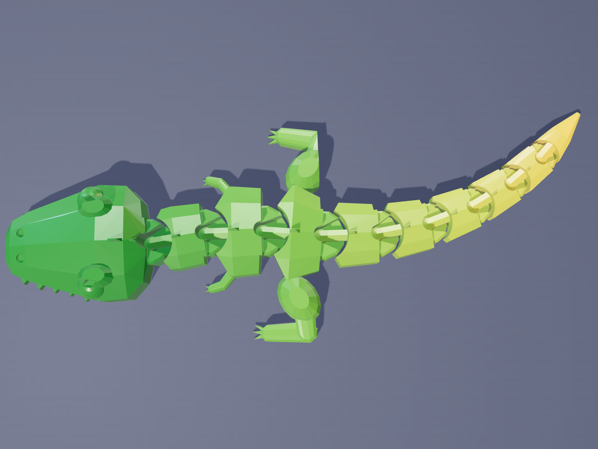
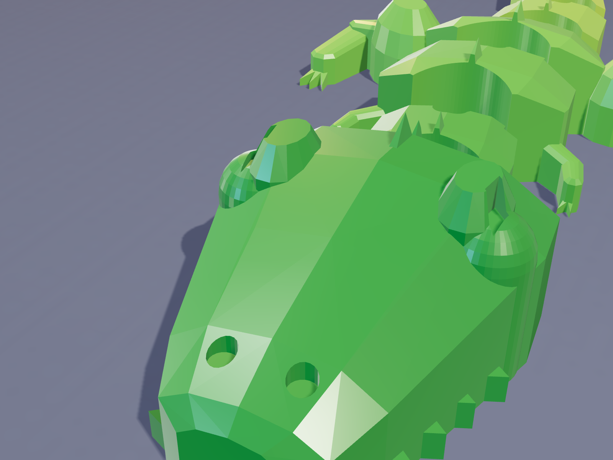
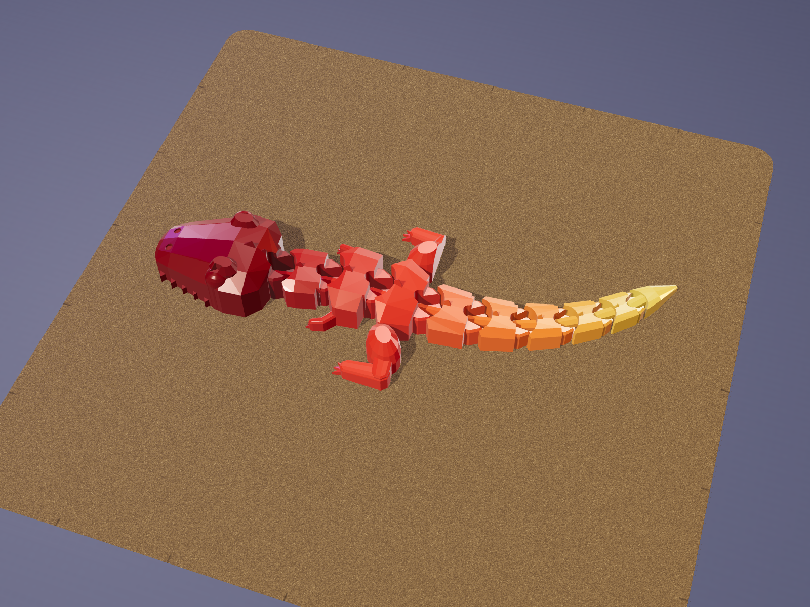
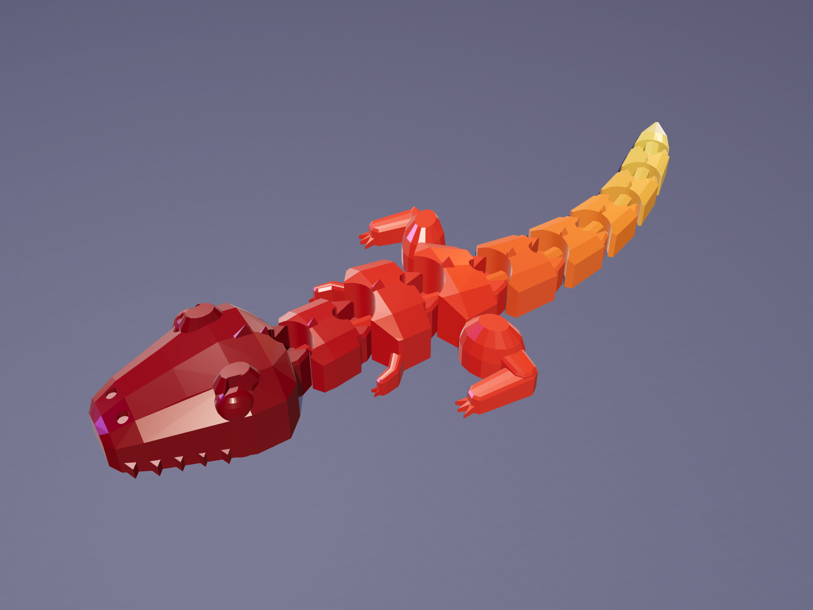
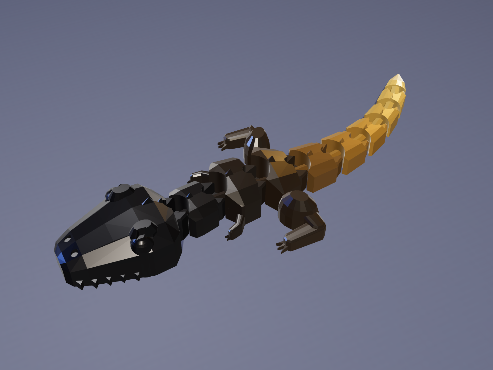
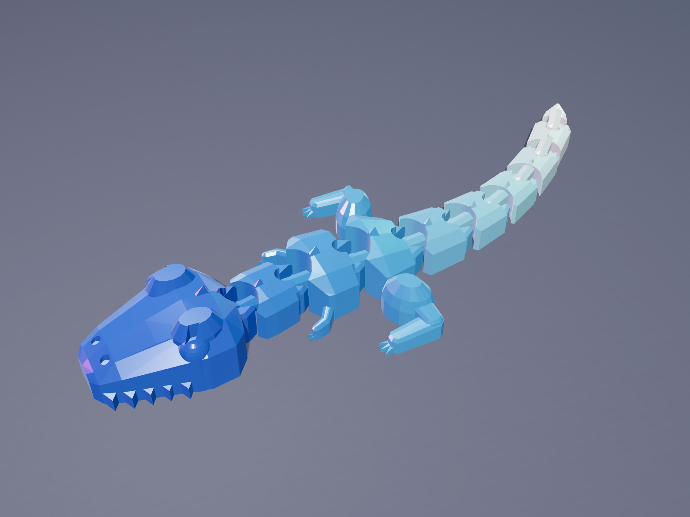
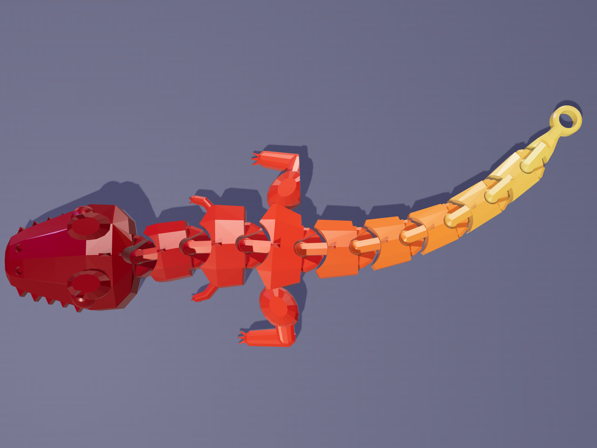

# Gemscale Flexi T-Rex: Blender generator for a classic print-in-place flexi T. rex


`gemscale_trex.py` is a single **Blender** script that builds a **classic flexi T. rex that
prints in one piece, fully assembled, with no supports**. It runs its own
printability checks and exports slicer-ready STL and 3MF files. A small three.js studio in
`render/` makes MakerWorld-style 4:3 cover images.

It's the fourth model in the Gemscale series, after the [Flexi Dragon](../gemscale-dragon/),
[Octopus](../gemscale-octopus/) and [Bat](../gemscale-bat/), and uses the same proven
print-in-place joint.

## The design

It's the classic flexi-toy layout, seen from above:
- **Head:** big and boxy, with a blunt snout, wide cheeks, a zig-zag of teeth along both lips,
  eyes on the sides under raised brow bumps, nostrils and two little crown spikes.
- **Body segments:** a short thick neck, a chest with **tiny arms**, and hips with **big
  drumstick legs** splayed out the sides and clawed feet.
- **Tail:** five tail segments and a pointed tip, curving round.

Every segment has a pitched, ridged roof with a dorsal spike, and the V-shaped gaps between
segments are the classic flexi look. It lies on its belly and every joint wiggles ±25° side to
side. Every part is lofted through flat-bottomed sections with vertical sides and a pitched roof,
so nothing overhangs and no supports are needed.

| | Mini | Standard |
|---|---|---|
| Size | 109 × 44 × 12 mm | 142 × 57 × 17 mm |
| Joints | 9 | 9 |
| Filament* | ~7 g | ~14 g |
| Bed | any (A1 mini and up) | any (A1 mini and up) |

\*Estimated from the solid volume (2 walls, 15 % infill, PLA). Slice in Bambu Studio for real
numbers before you publish them.



## Quick start

```bash
# with Blender 4.2+ (tested on 5.0)
blender -b -P gemscale_trex.py -- --preset standard --out models
blender -b -P gemscale_trex.py -- --preset mini --keyring --out models
blender -b -P gemscale_trex.py -- --preset standard --clearance 0.4 --out models   # looser joints

# or as plain Python with the bpy module (pip install bpy)
python gemscale_trex.py --preset standard --out models
```

You can also open the script in Blender's **Scripting** tab and press **Run Script**. A
**Gemscale** tab appears in the 3D-viewport sidebar (press N) with Generate and Export buttons.

Options: `--preset mini|standard`, `--clearance 0.35`, `--keyring` (a loop on the tail tip),
`--out DIR`, `--no-check`, `--save file.blend`. A full build takes about 30 seconds. The whole
design (head, segment sizes, limbs, joint sizes, the printed curve of the body) is in plain
tables at the top of the script, so it's easy to tweak.

Each run writes `GemscaleTRex_<preset>.stl` / `.3mf` (one object, every part a separate
shell) and a `_report.txt` with the size, estimated filament and all the check results. It
also writes a `.glb` and `_parts.json` for the renderer; these are not committed.

## Ready-to-print files (`models/`)

| File | Use |
|---|---|
| `GemscaleTRex_standard.3mf` | the main model |
| `GemscaleTRex_standard_clearance0p40.3mf` | looser joints for printers that run tight, or for PETG |
| `GemscaleTRex_mini.3mf` | the small, quick version |
| `GemscaleTRex_mini_keyring.3mf` | mini with a keychain loop on the tail |

STL copies are provided too.

## Print settings

- **0.20 mm layers.** The joint heights are snapped to this grid.
- **Supports off**, brim off, 2 walls, 15 % infill. Use PLA or silk PLA.
- Keep part cooling on so the short tongue bridges come out clean.
- After printing, work every joint gently. The first bend frees it.
- **Two-tone without an AMS:** add a filament change at about **8 mm** (mini: **6 mm**). The
  ridged tops of the head, body segments and thighs switch colour, and the lower sides, the tail
  end, the arms and the feet keep the first colour.

---

## How it works

### The joint

Each joint is the Gemscale captured swivel, with the same clearances as the other models:

```
 side view of one joint:                    top view:
          ____                               F | housing ( knob ) <- tongue - R
      ___/    \___  <- 45 deg: no support      | the notch lets the tongue swing
     |   knob     |  <- vertical band
      \___    ___/  <- 45 deg
          \__/        sits on the bed
```

- The front part (**F**) owns a round 12-sided housing with a double-cone socket and a notch.
- The rear part (**R**) owns a knob that sits in the socket, joined to R by a tongue that
  bridges over the notch floor.
- Clearances: 0.35 mm around the knob (settable), 0.40 mm of air under each tongue (two
  layers), 0.40 mm beside the tongue, and 0.50 mm between the housing and the next part's cup.
- R's material is clipped to the angles it can occupy after the whole swing, plus a 5° margin.
  A flat-topped hub under the cup gives the tongue a solid root.

### The parts and their joints

Ten parts: head, neck, chest, hips, five tail segments and the tip. At every joint the rear
part's front is cut to a 60° chevron round the pivot, so it clears the front part through the
whole ±25° swing plus a 5° margin. The front part ends in a round knuckle housing at the
pivot, and the knob-in-socket hardware is cut and added last. The legs and arms are checked
separately through the whole swing.

### Checks (every run)

1. Every part is a closed, valid manifold, and each part is a single connected piece.
2. Every gap inside a joint is at least the clearance. Unlinked parts are at least 0.4 mm apart.
3. Every joint swings through its full range, carrying everything beyond it, without touching
   anything else.
4. There are no unsupported overhangs steeper than 45° (0 mm²). The only exceptions are the
   short tongue bridges of the joints.
5. The model fits the bed with a 5 mm margin.
6. Every housing surrounds its socket.
7. No vertices merge when saved as float32, and every part is watertight as written to the
   STL/3MF.

These are geometric checks. Test-print a model before you publish it. The mini is a quick way
to check your printer's tolerances.

## Renders

```bash
cd render && npm install      # three.js + playwright-core; uses the system Chromium
node render.mjs ../models/GemscaleTRex_standard.glb out.png --view hero --scheme jungle
```

Views: `hero`, `top`, `face`, `plate` (on a textured PEI plate) and `promo` (4:3 card with
headline text). Schemes: `jungle`, `lava`, `ice`, `bone`, `galaxy`, `blackgold`. Set
`CHROMIUM=/path/to/chrome` if Chromium isn't at `/opt/pw-browsers/chromium`.

| | |
|---|---|
|  |  |
|  |  |
|  |  |

See [`MAKERWORLD_LISTING.md`](MAKERWORLD_LISTING.md) for the title, description, tags and
print-profile plan.
