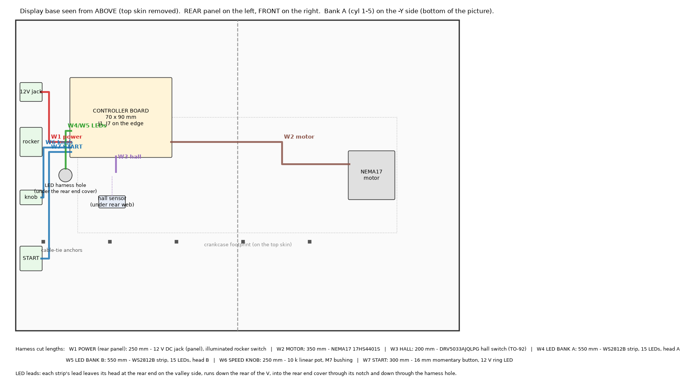
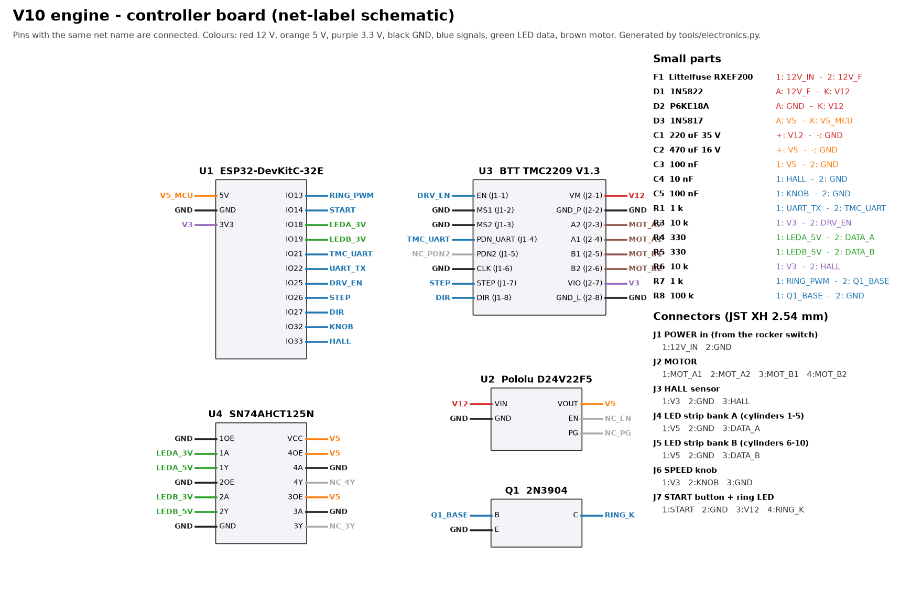
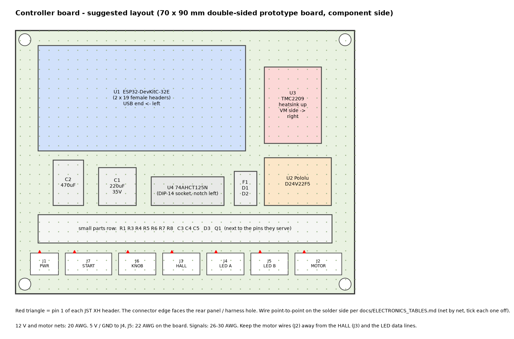

# Phase 4 - Electronics, wiring and firmware

Everything here comes from two sources of truth:

* `config.py` (engine geometry, speeds, LED layout) -> `tools/gen_firmware_config.py`
  writes `firmware/v10_engine/engine_geometry.h`, so the firmware always matches the CAD.
* `tools/electronics.py` (parts, pins, nets, harnesses) -> writes the netlist, the
  pin tables (`ELECTRONICS_TABLES.md`) and the three drawings in `docs/img/`.
  It also refuses to run if a net is open, a pin is on two nets, or a GPIO
  differs from `firmware/v10_engine/config.h`.

Verification that has been done (re-run with `python tools/check_firmware.py`):

| Check | Result |
|---|---|
| Firmware compiles for the ESP32 (Arduino-ESP32 2.0.17, FastAccelStepper 1.3.4, TMCStepper 0.7.3, Adafruit NeoPixel 1.15.5), all warnings on | 0 errors, 0 warnings, 363 kB flash (27 %), 28 kB RAM (8 %) |
| Firing order and LED timing vs. the CAD slider-crank model: crank angle at which every piston really reaches TDC | all 10 cylinders exact (0.00 deg difference) |
| Hall magnet pocket in the CAD crank web sits over the sensor at the crank angle the firmware assumes (216 deg) | pocket exactly over the sensor, solid web either side |
| Firmware logic unit tests on a PC (firing order, LED map, flash curve, magnet centre across the counter wrap, sync corrections and lost-step faults, a simulated slipping run) | all pass |
| Electronics model (every net closed, every pin on exactly one net, GPIOs match the firmware) | OK |

What cannot be verified without hardware: real current draw, motor temperature,
how the flames look. That is what the first-unit bring-up (section 8) and the
48 h burn-in (Phase 5) are for.

---

## 1. Controller choice: ESP32, not an Arduino Nano

**Correction:** an earlier message in this project said an Arduino Nano would be
enough. It is not, for this engine:

* 30 WS2812B LEDs take about 0.9 ms to update. On a Nano (ATmega328P) the LED
  library has to switch interrupts **off** for that whole time, at up to 200
  updates per second.
* At 120 engine RPM the motor needs 19,200 step pulses per second (one every
  52 us). With interrupts off for 0.9 ms the Nano drops or delays ~17 pulses
  per LED update: audible jerks, and the LED timing drifts away from the pistons.
* The Nano has 2 kB of RAM and no hardware step counter.

The **ESP32** makes the step pulses in hardware (MCPWM), sends the LED data in
hardware (RMT), and counts every step pulse in hardware (PCNT) - that counter
*is* the crank angle the LEDs are timed from. It has two cores, 320 kB RAM,
a hardware UART for the TMC2209 and non-volatile storage for settings and the
run-hour counter. Board: **Espressif ESP32-DevKitC-32E** (ESP32-WROOM-32E,
38 pins). It costs about the same as a genuine Nano.

## 2. System overview

* **Power:** 12 V 2 A desktop adapter -> panel jack -> illuminated rocker ->
  controller board (2 A resettable fuse, reverse-polarity diode, 18 V TVS,
  220 uF bulk capacitor). A Pololu D24V22F5 makes 5 V for the LEDs and the ESP32.
* **Motor:** NEMA17 (17HS4401S, 1.7 A rated) on a TMC2209 in StealthChop,
  run at 0.6 A RMS (35 % of rating) and 0.21 A when holding. The motor
  stays cool: about 1 W of heat, and it is mounted on its own printed ASA
  bulkhead in the base, away from the engine (thermal isolation).
* **Crank sensing:** one 6 x 3 mm magnet in each end web (both webs are the
  same part - fit a magnet in both, only the rear one is read). A DRV5033
  omnipolar hall switch lies face-up in a pocket under the crankcase floor,
  below the rear web. Magnet polarity does not matter.
* **LEDs:** one WS2812B strip per bank (15 LEDs, 3 over every bore), lying in
  the groove in the cylinder head's deck face, LEDs pointing into the bores.
* **Controls (rear panel):** 12 V jack, illuminated power rocker, speed knob
  (10 k pot), START button with a ring LED.

## 3. Electronics parts (per engine)

Prices are typical 2026 single-quantity / 50-unit prices in USD; the full
BOM with every part is in `docs/BOM.md`.

| # | Part | Exact part / search term | Qty | Each (x1) | Each (x50) |
|---|---|---|---|---|---|
| E1 | Controller | Espressif **ESP32-DevKitC-32E** (WROOM-32E, 38 pin) | 1 | 10.00 | 9.00 |
| E2 | Stepper driver | **BIGTREETECH TMC2209 V1.3** (UART capable, 0.11 ohm sense) | 1 | 6.00 | 4.50 |
| E3 | 5 V regulator | **Pololu D24V22F5** (5 V 2.5 A, fixed output - no trimmer to mis-set) | 1 | 11.00 | 9.50 |
| E4 | Level shifter | TI **SN74AHCT125N** (DIP-14) + DIP-14 socket | 1 | 0.90 | 0.60 |
| E5 | Hall switch | TI **DRV5033AJQLPG** (TO-92, omnipolar, 2.5-38 V, open drain) | 1 | 0.80 | 0.60 |
| E6 | Power supply | Mean Well **GST25A12-P1J** (12 V 2.08 A, 5.5/2.1 mm, centre +) + IEC C7 cord for the customer's country | 1 | 17.00 | 14.00 |
| E7 | DC jack | 5.5 x 2.1 mm panel jack, 11 mm thread, nut | 1 | 1.50 | 0.80 |
| E8 | Power switch | Round illuminated rocker, 20 mm (KCD1 round, 3 pin, 12 V lamp) | 1 | 1.50 | 0.90 |
| E9 | START button | 16 mm stainless momentary, 1NO, **12 V** ring LED | 1 | 3.50 | 2.50 |
| E10 | Speed knob | 10 k linear pot, 16 mm body, M7 bushing, 6 mm shaft + 20 mm aluminium knob | 1 | 3.50 | 2.50 |
| E11 | Motor | StepperOnline **17HS4401S** (1.7 A, 40 Ncm, 40 mm) | 1 | 12.00 | 10.00 |
| E12 | LED strip | BTF-LIGHTING **WS2812B 60 LED/m, black PCB, IP30, 5 V** (cut 2 x 15 LEDs) | 0.5 m | 2.00 | 1.60 |
| E13 | Board | 70 x 90 mm double-sided FR4 prototype board | 1 | 0.80 | 0.40 |
| E14 | Connectors | JST XH 2.54 mm: headers 2/3/3/3/3/4/4 pin + housings + pre-crimped leads | 1 set | 3.00 | 2.00 |
| E15 | Small parts | F1 RXEF200, D1 1N5822, D2 P6KE18A, D3 1N5817, C1 220 uF 35 V, C2 470 uF 16 V, C3/C5 100 nF, C4 10 nF, R1/R7 1 k, R3/R6 10 k, R4/R5 330, R8 100 k, Q1 2N3904, female headers | 1 set | 3.50 | 2.00 |
| E16 | Wire + sleeving | silicone 20/22/24/26 AWG (LED leads 24 AWG), 6 mm black braided sleeve, heat-shrink, 4.8 mm insulated spade terminals | 1 set | 3.00 | 2.00 |
| E17 | Hall magnets | 6 x 3 mm N52 disc (same as the cover magnets) | 2 | 0.20 | 0.10 |
| | **Electronics total** | | | **~80** | **~63** |

Buy the motor, driver, ESP32 boards and LED strip for all 50 units from one
batch each: the motor cable colours, driver pinout and strip pitch are then
identical on every unit.

## 4. Controller board

The full pin-by-pin tables (ESP32 pins, TMC2209 header pins, every board
connector, every harness wire, the netlist) are in
[`ELECTRONICS_TABLES.md`](ELECTRONICS_TABLES.md) and `ELECTRONICS_NETLIST.csv`.

### Build order (one board, ~60 min)

1. Solder the DIP-14 socket, the 2 x 19, 2 x 8 and 1 x 5 female headers - **with
   the ESP32, TMC2209 and Pololu plugged in**, so the spacing is automatically
   right (ESP32 boards come with slightly different row spacings).
2. Solder the seven JST XH headers along one edge, latch side facing outwards,
   pin 1 at the left as in the layout drawing. Write the connector names next
   to them with a fine paint pen.
3. Fit the small parts. Polarised parts: C1 / C2 stripe = minus, D1 / D3 / D2
   band = cathode (towards V12 / V5_MCU / V12), Q1 flat face as drawn.
4. Wire the power nets first with 20 AWG (12V_IN, 12V_F, V12, GND), then V5 and
   V5_MCU with 22 AWG, then the signals with 26-30 AWG. Work through the netlist
   in `ELECTRONICS_TABLES.md` and tick each net off.
5. **Before plugging any module in:** with a multimeter, check there is no short
   between V12, V5, V3 and GND, and continuity of every net (tick list).
6. Power from a bench supply set to **12 V, 0.3 A limit**, modules out: V12 =
   11.4-11.7 V (after D1), nothing gets warm. Plug in U2: V5 = 4.9-5.1 V.
   Plug in U1 and U4: V3 = 3.25-3.35 V at J3-1. Then plug in U3 (the TMC2209):
   still under 0.15 A with the motor unplugged.

### Mounting

The board hangs components-down from the four standoffs under the top skin of
the rear base half (M3 x 8 into heat-set inserts; drill the board's corner holes
to 3.2 mm if they are smaller). The connector edge faces the rear panel.

## 5. Harnesses

Every harness, wire colour, gauge and cut length is listed in
[`ELECTRONICS_TABLES.md`](ELECTRONICS_TABLES.md#harnesses). Key points:

* **Motor (W2):** coil A = J2 pins 1-2, coil B = pins 3-4. Before plugging in,
  measure: J2-1 to J2-2 and J2-3 to J2-4 about 1.5 ohm each, J2-1 to J2-3 open.
  A wrong pairing makes the motor buzz without turning - nothing breaks.
  Never plug or unplug the motor with the power on (it can kill the driver).
* **Hall sensor (W3):** solder the three wires to the sensor leads 2 mm from the
  body, heat-shrink each joint. The sensor lies **branded face up** in the
  pocket under the crankcase floor; its leads bend down through the slot in the
  base top, which also traps the body. Fit it before the crankcase goes onto
  the base.
* **LED strips (W4, W5):** cut 15 LEDs (on the cut marks). Solder the lead to
  the **DIN** end (arrows on the strip point away from it). The lead end goes
  to the **rear** of the engine in both heads. Stick the strip into the deck
  groove LEDs facing out of the groove, lead in the short side groove at the
  rear end towards the valley. Each lead runs down the rear of the V, into the
  rear end cover through its notch, through the harness hole into the base.
  Sleeve both leads together in 6 mm braided sleeve from the V to the base.
* **Strain relief:** every harness is tied to the cable-tie anchors in the base
  within 30 mm of the board, so no pull ever reaches a connector or a joint.
  Panel parts use insulated 4.8 mm spade terminals (rocker) or soldered joints
  with heat-shrink (jack, button, pot).

## 6. Power budget

| Load | Typical | Maximum |
|---|---|---|
| Motor (from 12 V, StealthChop, 0.6 A RMS in the coils) | 0.15 A | 0.35 A |
| 5 V rail via the regulator (ESP32 0.1 A, 30 LEDs capped at 170/255 brightness, 74AHCT125) | 0.15 A at 12 V | 0.45 A at 12 V |
| START ring LED + rocker lamp | 0.03 A | 0.03 A |
| **Total from the adapter** | **~0.35 A** | **~0.85 A** of 2.08 A |

## 7. Firmware

Source: `firmware/v10_engine/` (`main.cpp`, `config.h`, `engine_logic.h`,
generated `engine_geometry.h`). Library and core versions are pinned - use
exactly these:

**Arduino IDE 2.x:** Boards Manager -> "esp32 by Espressif Systems" version
**2.0.17**. Library Manager -> FastAccelStepper **1.3.4**, TMCStepper **0.7.3**,
Adafruit NeoPixel **1.15.5**. Open `firmware/v10_engine/v10_engine.ino`,
board "ESP32 Dev Module", upload.

**PlatformIO:** `cd firmware && pio run -t upload` (versions pinned in
`platformio.ini`).

Flash with the 12 V supply **off** (the ESP32 runs from USB; D3 keeps USB power
out of the LED strips). The firmware is the same for all 50 units; per-unit
settings (motor direction, timing trim, auto-sleep, run hours) live in the
ESP32's flash and survive re-flashing.

### What it does

| Mode | How you get there | What happens |
|---|---|---|
| Homing | power on | turns at 15 RPM until the hall magnet passes, then parks cylinder 1 at TDC. START pressed during homing = run as soon as it is parked |
| Ready | after homing / after a stop | motor holds at low current, LEDs off, START ring breathes |
| Run | START (short press) | soft start (jerk-free S-ramp, 15 RPM/s), knob sets 20-120 RPM, every cylinder flashes at its own TDC in the firing order 1-6-5-10-2-7-3-8-4-9 |
| Idle | knob at the bottom, or 5 min with no one touching it | 20 RPM, dimmer and redder flames |
| Stopping | START (short press) while running | soft stop, LEDs stay in time until it stands still |
| Sleep | START held 2 s, or 15 min without interaction (also from Ready) | motor current off, LEDs off, ring breathes slowly. START wakes it; the LEDs rejoin at the first magnet pass |
| Fault | detected problem | motor stopped and switched off, all LEDs blink the fault code in red, ring flashes. START clears it and re-homes |
| Service | hold START while switching on (3 s) | LED test (each cylinder in firing order, then red/green/blue), homes and parks: cylinder 1 (front left) LEDs stay lit and its piston must be at the very top. Long press = flip motor direction (saved, restarts) |
| Burn-in | hold START while switching on **with the knob at maximum**, or type `burnin 48` | 48 h profile (see Phase 5 burn-in), logs a CSV line per minute on USB, ends with steady green (pass) or the fault code |

### Fault codes (red blinks)

| Blinks | Meaning | First thing to check |
|---|---|---|
| 1 | hall magnet not found while homing | magnet in the rear end web? sensor face up? W3 plugged in? |
| 2 | lost steps (magnet more than 8 deg from where the step count says) | belt tension, something rubbing, motor current |
| 3 | no rotation for 1.4 revolutions while running | jam, broken/loose belt, loose pulley grub screw |
| 4 | stepper driver not answering / over-temperature / short | 12 V present? W2 shorted? driver seated? |
| 5 | supply problem (driver saw undervoltage or a reset) | adapter, jack, rocker contacts |

### USB serial console (115200 baud)

`status`, `run <rpm>`, `stop`, `sleep`, `wake`, `home`, `ledtest` (engine
stopped), `burnin <hours>`, `dir` (flip motor direction), `trim <deg>` (LED
timing trim, default 0), `autosleep <min>` (0 = never), `clear`, `version`.
`status` also shows the run-hour counter and the lifetime fault count, which the
maintenance schedule uses.

### How the LEDs stay exactly in time

The ESP32's pulse counter counts every STEP pulse and wraps every 19,200 steps
(one 720 deg four-stroke cycle at 16 microsteps and 3:1). That count is the
crank angle. Once per revolution the hall magnet re-checks it: the magnet
centre is taken halfway between the sensor's switch-on and switch-off edges,
so sensor sensitivity and air gap do not matter. Differences up to 3 deg are
corrected silently; more than 8 deg means the motor lost steps (fault 2); no
magnet for 1.4 revolutions means a jam or stall (fault 3). Nothing drifts,
even after days of running.

## 8. First power-on of a finished engine (bring-up)

Do this on the first unit, then on every unit as part of the QC checklist.

1. Bottom panels off, 12 V adapter **not** plugged in. Check the W2 coil
   resistances (section 5).
2. Plug USB in only, open the serial console: you get the version banner and
   fault 4 (driver not powered) - correct, the TMC2209 needs 12 V.
3. Unplug USB. Plug in 12 V, rocker on. The engine homes: it turns slowly,
   stops, and the START ring breathes. Fault 1 instead -> magnet/sensor.
4. Service mode (hold START while switching on): all 30 LEDs light in the LED
   test in firing order - cylinder 1 front left, 6 front right, 5 rear left...
   If one bank stays dark: strip lead on the wrong (DOUT) end, or W4/W5 swapped.
5. After the test it parks: cylinder 1's piston must be exactly at the top.
   Look from the front: the crank must have turned **clockwise**. If it turned
   anticlockwise, hold START for 2 s (direction flips and is saved).
6. Normal start, run through the speed range, check it is quiet and smooth,
   then run the 48 h burn-in (Phase 5).
